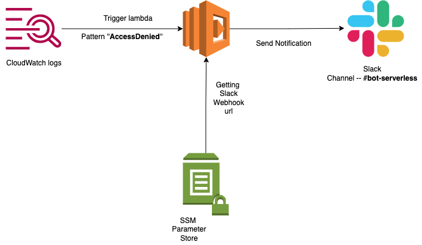

# bot-serverless


## About
**bot-serverless** is a bot which send notification to slack channel when certain error string found in cloudwatch logs  

## Prerequisites
  1. Metric filer is used to filer the logs depending upon the string you passed. 
  For more information you can go through
  [metric-filer](https://docs.aws.amazon.com/AmazonCloudWatch/latest/logs/FilterAndPatternSyntax.html)

  2. Create a webhook url for for slack channel. For more information on how to craete webhook url you can go through.
   [slack-webhook](https://slack.com/intl/en-in/help/articles/115005265063-Incoming-webhooks-for-Slack)

## Development Setup
1. Clone the repository
   ```
   git clone https://gitlab.com/bharatnainani/bot-serverless.git
   cd bot-serverless
   ```

2. Create a SSM parameter store and store the webhook url in parameter store, make sure to use secureString(for security reasons)
   We can create parameter using
   ```
   WEBHOOK_URL="add_slack_webhook_url_here"
   aws ssm put-parameter --cli-input-json '{"Type": "SecureString", "KeyId": "alias/aws/ssm", "Name": "SlackWebHookURL", "Value":   "'"$WEBHOOK_URL"'"}'
   ```
   For more informaton in ssm parameter store 
    [ssm-parameter](https://docs.aws.amazon.com/systems-manager/latest/userguide/systems-manager-parameter-store.html)
  
3. Edit the config file depending upon your requirement
   ```
   ./config/dev.yml
   ```
   
   ```
    REGION: eu-west-2
    STAGE: dev
    LOG_GROUP_NAME: /aws/lambda/s3list
    FILTER_PATTERN: 'AccessDenied'
    WEBHOOK_URL_NAME: "SlackWebHookURL"
   ```
4. Edit the **main.py** file if you want to change the message template for slack,
   checkout the link beelow for more templates
   [slack-message-template](https://app.slack.com/block-kit-builder/TMJ9DBEG2#%7B%22blocks%22:%5B%7B%22type%22:%22section%22,%22text%22:%7B%22type%22:%22mrkdwn%22,%22text%22:%22You%20have%20a%20new%20request:%5Cn*%3CfakeLink.toEmployeeProfile.com%7CFred%20Enriquez%20-%20New%20device%20request%3E*%22%7D%7D,%7B%22type%22:%22section%22,%22fields%22:%5B%7B%22type%22:%22mrkdwn%22,%22text%22:%22*Type:*%5CnComputer%20(laptop)%22%7D,%7B%22type%22:%22mrkdwn%22,%22text%22:%22*When:*%5CnSubmitted%20Aut%2010%22%7D,%7B%22type%22:%22mrkdwn%22,%22text%22:%22*Last%20Update:*%5CnMar%2010,%202015%20(3%20years,%205%20months)%22%7D,%7B%22type%22:%22mrkdwn%22,%22text%22:%22*Reason:*%5CnAll%20vowel%20keys%20aren't%20working.%22%7D,%7B%22type%22:%22mrkdwn%22,%22text%22:%22*Specs:*%5Cn%5C%22Cheetah%20Pro%2015%5C%22%20-%20Fast,%20really%20fast%5C%22%22%7D%5D%7D,%7B%22type%22:%22actions%22,%22elements%22:%5B%7B%22type%22:%22button%22,%22text%22:%7B%22type%22:%22plain_text%22,%22emoji%22:true,%22text%22:%22Approve%22%7D,%22style%22:%22primary%22,%22value%22:%22click_me_123%22%7D,%7B%22type%22:%22button%22,%22text%22:%7B%22type%22:%22plain_text%22,%22emoji%22:true,%22text%22:%22Deny%22%7D,%22style%22:%22danger%22,%22value%22:%22click_me_123%22%7D%5D%7D%5D%7D)


5. Install serverless framework (may require sudo)
   ```
   npm install -g serverless
   ```
   For more information on how to install srerverless
   Refer [Serverless Installation Documentation](https://www.serverless.com/framework/docs/getting-started#install-as-a-standalone-binary)

6. Install plugins of serverless framework
   ```
   sls plugin install -n serverless-python-requirements
   ```
## Development 
   ```
   sls deploy -s dev 
   ```

